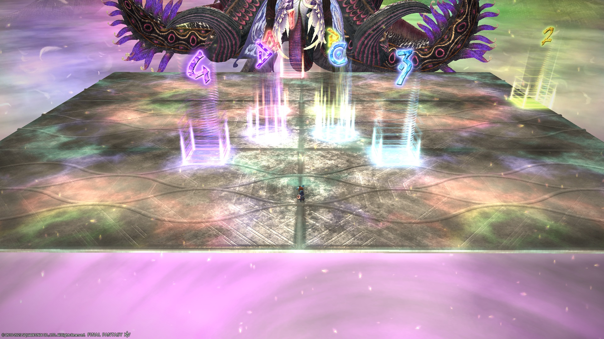
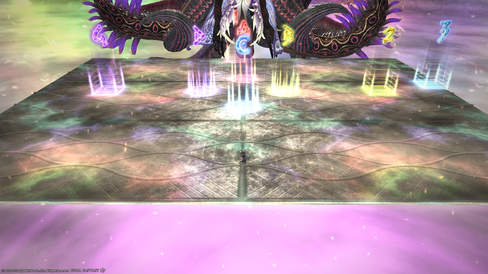

# Anabaseios: The Twelfth Circle (Savage) - Part 2

[Game8](https://game8.jp/ff14/535668) has listed out a strat, but oddly has not published a macro (yet).

Nukemaru has published a video outlining the PF strat:


*(English subtitled)*

### Things to check on Party Finder

- Check the Caloric Theory 1 strat.
  - **Japanese** parties will go with [Mochibe's strat](#mochibes-caloric-theory-1)
  - **English** parties will go with [Papan's strat](#papans-caloric-theory-1).
- Check whether the party will line up for Pangenesis (パンゲ整列).
  - Parties that **will not** line up for Pangenesis will mention something like 非整列 or 整列なし.

## Nukemaru + Mochibe's Caloric 1

This is the preferred strat by JP.

### English (Mochibe)

```

```

### Japanese (Mochibe)

```

```

### Markers (Mochibe)

The following markers are for Mochibe's Caloric Theory 1 strat:


<details markdown=block>
<summary>XIVLauncher WaymarkPresetPlugin positions</summary>

```json
{"Name":"P12S-2 (Mochibe)","MapID":943,"A":{"X":97.67,"Y":0.0,"Z":92.67,"ID":0,"Active":true},"B":{"X":102.33,"Y":0.0,"Z":92.67,"ID":1,"Active":true},"C":{"X":102.33,"Y":0.0,"Z":97.33,"ID":2,"Active":true},"D":{"X":97.67,"Y":0.0,"Z":97.33,"ID":3,"Active":true},"One":{"X":99.0,"Y":0.0,"Z":81.0,"ID":4,"Active":true},"Two":{"X":119.0,"Y":0.0,"Z":91.0,"ID":5,"Active":true},"Three":{"X":105.67,"Y":0.0,"Z":101.0,"ID":6,"Active":true},"Four":{"X":94.33,"Y":0.0,"Z":101.0,"ID":7,"Active":true}}
```

</details>

## Nukemaru + Papan's Caloric 1

This is the preferred strat by EN. The macro below follows [Papan's Toolbox](https://ff14.toolboxgaming.space/?id=845983862306861&preview=1).

<div style="background-color: #200 ; padding: 10px; border: 1px solid;">
<b>Note:</b> There is a <a href="https://youtu.be/r1aDCRfNTWc"><b>video guide on Papan's strat</b></a>- however, it has <em>flipped the melee and ranged priority</em> from the Toolbox (and thus is also flipped from the macro).</div>

### English (Papan)

```

```

### Markers (Papan)

The following markers are for Papan's Caloric Theory 1 strat:


<details markdown=block>
<summary>XIVLauncher WaymarkPresetPlugin positions</summary>

```json
{"Name":"P12S-2 (Papan)","MapID":943,"A":{"X":100.0,"Y":0.0,"Z":89.0,"ID":0,"Active":true},"B":{"X":104.0,"Y":0.0,"Z":93.0,"ID":1,"Active":true},"C":{"X":100.0,"Y":0.0,"Z":97.0,"ID":2,"Active":true},"D":{"X":96.0,"Y":0.0,"Z":93.0,"ID":3,"Active":true},"One":{"X":99.0,"Y":0.0,"Z":81.0,"ID":6,"Active":true},"Two":{"X":113.0,"Y":0.0,"Z":93.0,"ID":5,"Active":true},"Three":{"X":119.0,"Y":0.0,"Z":91.0,"ID":7,"Active":true},"Four":{"X":87.0,"Y":0.0,"Z":93.0,"ID":4,"Active":true}}
```

</details>

## Classical Concepts

There is a site built for Classical Concepts that you can use for practice:

[https://idea-elemental.pages.dev/](https://idea-elemental.pages.dev/)

### Palladian Ray

Palladian Rays need to be baited at the end of each Classical Concepts. However, because the mechanics resolve in a different order each time, the way the Rays are baited will also change.

The most common way to bait the rays is:

- Baiting the first Rays in a 'K'-formation.
- Baiting the second Rays in an 'X'-formation.

<table>
  <tr>
    <td width="50%">
      <p><b>Palladian Ray #1</b></p>
      <p>Players will dodge the shapes' AoEs first, <em>then</em> bait the Palladian Rays in this formation (that looks like the letter 'K').</p>
    </td>
    <td></td>
  </tr>
  <tr>
    <td width="50%">
      <p><b>Palladian Ray #2</b></p>
      <p>Players will bait the Palladian Rays <em>between the shapes</em> in this formation (which will looks like the letter 'X') first, <em>then</em> dodge the shapes' AoEs (which also avoids the lingering cone AoEs).</p>
      <p>Note that because of Panta Rhei (which rotated all the shapes), the 〇×▽□ order is flipped (although α still takes the north, and β takes the south).</p>
    </td>
    <td></td>
  </tr>
</table>

## Caloric Theory 1

There are two strategies used for Caloric Theory 1.

### Mochibe's Caloric Theory 1

This is the strategy favoured by Japanese parties.

<table>
  <tr>
    <td width="50%"><p><b>1.</b> One random tank/healer and one random DPS will be targeted with a Fire mark.</p>
    <p><em>In this example, ST and D3 are marked for Fire.</em></p>
    <ul>
      <li><b>Marked players:</b> Stand on either side of the blue-line intersection above the A and B markers.
        <ul>
          <li><b>Tank/healer:</b> Stand to the <b>west</b> of the intersection.</li>
          <li><b>DPS:</b> Stand to the <b>east</b> of the intersection.</li>
        </ul>
      </li>
      <li><b>All other players:</b> Stand between the C and D markers.</li>
    </ul></td>
    <td></td>
  </tr>
  <tr>
    <td><p><b>2.</b> One of the marked players (at random) will be targeted for a shared damage AoE (shared between both marked players).</p>
    <p>The party also takes raid-wide damage.</p>
    <p>All party members get marked with either Pyrefaction (Fire ) or Atmosfaction (Wind ) debuffs.</p>
    <ul><li>The two marked players are guaranteed to get Wind.</li><li>The remaining four Fire and two Wind debuffs are randomly distributed among the six unmarked players.</li></ul>
    <p><em>In this example:</em></p>
    <ul>
      <li><em>MT, D1, D2, D4 are marked for Fire.</em></li>
      <li><em>ST, H1, H2, D3 are marked for Wind.</em></li>
    </ul></td>
    <td></td>
  </tr>
  <tr>
    <td><p><b>3.</b> Move to create four pairs of Fire + Wind.</p>
    <ul>
      <li><b>Initially marked players:</b> Follow the blue line on the ground west/east, and stop directly above the A and B markers.</li>
      <li><b>All other players:</b> Take turns moving into position, following the priority order.</li>
    </ul>
    <p><b>Clockwise from A:</b> MT ST H1 H2 D1 D2 D3 D4</p>
    <p>The pairs on the north side should stand in the markers, but <b>above</b> the blue line.</p>
    <p>Similarly, the pairs on the south side should stand in the markers, but <b>below</b> the blue line.</p>
    <p><em>In this example, we have:</em></p>
    <ul>
      <li><em><b>A (NW):</b> MT (Fire), ST (Wind)</em></li>
      <li><em><b>B (NE):</b> D1 (Fire), D3 (Wind)</em></li>
      <li><em><b>C (SE):</b> D2 (Fire), H1 (Wind)</em></li>
      <li><em><b>D (SW):</b> D4 (Fire), H2 (Wind)</em></li>
    </ul></td>
    <td></td>
  </tr>
  <tr>
    <td><p><b>4.</b> Fire stacks resolve.</p><p>Two of the four players that had Fire (at random) will keep their Fire debuffs.</p>
    <p><em>In this example, MT and D4 kept their Fire debuff.</em></p></td>
    <td></td>
  </tr>
  <tr>
    <td><p><b>5.</b> Wind players move out, while (previously) Fire players rearrange themselves to create two Fire + no-debuff pairs at the B and D markers.</p>
    <ul>
      <li><b>Wind players:</b> Move diagonally outwards to the next blue-line intersection on the ground.</li>
      <li><b>(Previously) Fire players:</b> Either move vertically, or criss-cross to create two pairs at the A and B markers.</li>
    </ul>
    <p><em>In this example, D4 and D2 have to cross diagonally (the worst-case scenario).</em></p></td>
    <td></td>
  </tr>
  <tr>
    <td><p><b>6.</b> Fire stacks and Wind AoEs resolve.</p></td>
    <td></td>
  </tr>
</table>

### Papan's Caloric Theory 1

This is the strategy favoured by English parties.

<table>
  <tr>
    <td width="50%"><p><b>1.</b> Preposition with the healers + ranged at their assigned spots, and the tanks + melee in the middle of all the markers.</p><p>One random tank/healer and one random DPS will be targeted with a Fire mark.</p>
    <p><em>In this example, ST and D3 are marked for Fire.</em></p></td>
    <td></td>
  </tr>
  <tr>
    <td><p><b>2.</b> Swap positions as needed to get the marked players on the east (B) and west (D) markers.</p>
    <ul>
      <li><b>Marked tank/healer:</b> Swap positions with H1 (west).</li>
      <li><b>Marked DPS:</b> Swap positions with D4 (east).</li>
    </ul>
    <p>The players on the B and D markers should stand in the markers, but <b>towards the party in the middle</b>.</p></td>
    <td></td>
  </tr>
  <tr>
    <td><p><b>3.</b> One of the marked players (at random) will be targeted for a shared damage AoE (shared with all the players in the middle).</p>
    <p>The party also takes raid-wide damage.</p>
    <p>All party members get marked with either Pyrefaction (Fire ) or Atmosfaction (Wind ) debuffs.</p>
    <ul><li>The two marked players are guaranteed to get Wind.</li><li>The remaining four Fire and two Wind debuffs are randomly distributed among the six unmarked players.</li></ul>
    <p><em>In this example:</em></p>
    <ul>
      <li><em>MT, D1, D2, D4 are marked for Fire.</em></li>
      <li><em>ST, H1, H2, D3 are marked for Wind.</em></li>
    </ul></td>
    <td></td>
  </tr>
  <tr>
    <td><p><b>4.</b> Move to create four pairs of Fire + Wind.</p>
    <p>Take turns moving into position, following the priority order.</p>
    <p><b>CCW from West:</b> H1 MT ST D2 D1 D4 <b>:CW from North</b></p>
    <p><em>(This is essentially ranged adjust first, then melee, with the MT group going first.)</em></p>
    <p><em>In this example, we have:</em></p>
    <ul>
      <li><em><b>North:</b> D4 (Fire), H1 (Wind)</em></li>
      <li><em><b>East:</b> D1 (Fire), D3 (Wind)</em></li>
      <li><em><b>South:</b> D2 (Fire), H2 (Wind)</em></li>
      <li><em><b>West:</b> MT (Fire), ST (Wind)</em></li>
    </ul></td>
    <td></td>
  </tr>
  <tr>
    <td><p><b>5.</b> Fire stacks resolve.</p><p>Two of the four players that had Fire (at random) will keep their Fire debuffs.</p>
    <p><em>In this example, MT and D4 kept their Fire debuff.</em></p></td>
    <td></td>
  </tr>
  <tr>
    <td><p><b>6.</b> Wind players move out, while (previously) Fire players rearrange themselves to create two Fire + no-debuff pairs at the B and D markers.</p>
    <ul>
      <li><b>Wind players:</b> Move out to either the blue-line intersection on the ground (if you are North or South), or to the next set of waymarks (if you are East or West).</li>
      <li><b>(Previously) Fire players:</b> Rotate as needed to create two pairs at the A and B markers. Prioritise rotating <b>clockwise</b>, but be prepared to rotate anti-clockwise if clockwise doesn't give the correct configuration.</li>
    </ul>
    <p><em>In this example, D4 and D2 rotate clockwise.</em></p></td>
    <td></td>
  </tr>
  <tr>
    <td><p><b>7.</b> Fire stacks and Wind AoEs resolve.</p></td>
    <td></td>
  </tr>
</table>

## Timeline

*(Credit: [u/ExiaKuromonji](https://www.reddit.com/r/ffxiv/comments/141y028/spoiler64_p12s_part_2_timeline_and_abilities/))*

## Frequently Asked Questions

<details markdown=block>
<summary><b>[Damage Down]</b> How strong is the damage down debuff in this fight?</summary>
<table>
  <tr><td><p>The Damage Down debuff in this phase lowers a player's damage by <b>42%</b>.</p></td></tr>
</table>
</details>
<details markdown=block>
<summary><b>[Caloric Theory]</b> How does Close Caloric gain stacks?</summary>
<table>
  <tr>
    <td><p>Close Caloric accumulates the <b>total</b> distance a player has moved with the debuff active.</p><p>Players gain a stack of Close Caloric when they first move, and then gain additional stacks from:</p>
    <ul>
      <li>Getting hit by the Fire stacks <em>and</em></li>
      <li>Every 9 yalms of movement (accumulated)</li>
    </ul>
    <p>The diagram on the right illustrates how far 9 yalms is on the arena, assuming you move in a straight line outwards.</p></td>
    <td></td>
  </tr>
</table>
</details>
<details markdown=block>
<summary><b>[Caloric Theory 1 (Papan)]</b> Why is the priority order so strange? Why is H2 and D3 missing from the priority?</summary>
<table>
  <tr><td><p>Papan's strat does quite a lot of things that do not follow historical convention for some reason.</p><p>The idea behind Papan's priority is that starting from the two end points (West for tanks and healers, and North for DPS), ranged have priority before melee, with the MT group going first, over the ST group.</p>
  <p>Put another way, it is effectively the same as:</p>
  <ul>
    <li><b>CCW from West:</b> H1 > MT > ST</li>
    <li><b>CW from North:</b> D4 > D1 > D2</li>
  </ul>
  <p>As for why H2 and D3 are missing from the priority, recall that the priority applies to the players in the <em>middle</em> that need to fill in waymarked positions.</p><p>Since H2 and D3 start on a marker, and will only ever swap with H1 and D4 (who are also on markers), H2 and D3 will <em>never</em> be in the middle group, so there is no need for them to be in the priority list.</p><p>H1 and D4, on the other hand, <em>do</em> need to be in the priority order, because they may potentially swap with a melee and putting them in the middle to fill in empty spots later.</p></td></tr>
</table>
</details>